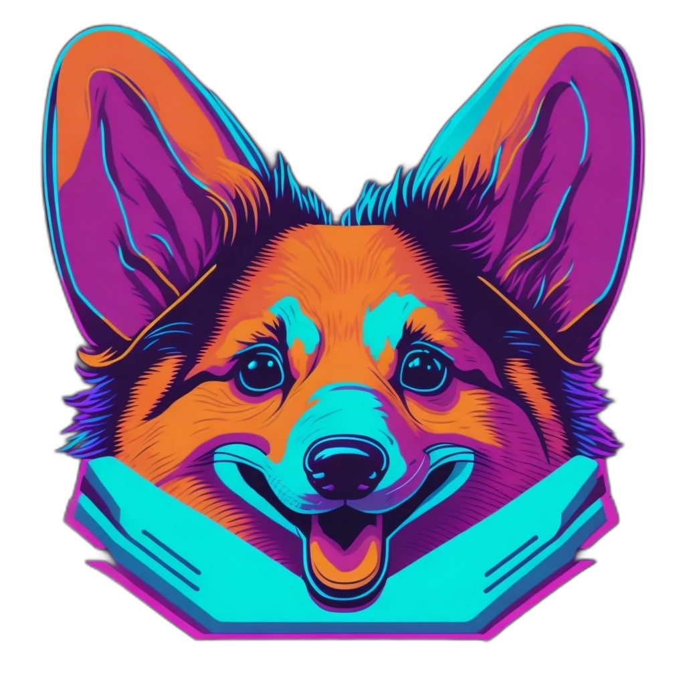

  

<h1 align="center">DB Funky Pixels</h1>

  Database project in <b>🐘PostgreSQL🐘</b> for small and simplified social platform based on the idea of <a href="https://kwejk.pl/" alt="Link to kwejk.pl.">kwejk</a>.

  

<i>Database schema made in www.draw.io.</i>

<h2>ℹ️ About Funky Pixels</h2>

Funky Pixels is social platform project, created to share humorous multimedia content.

The idea for this project comes from an initiative that me and my friends took in high school. Unfortunately, due to lack of skills and experience, the project was terminated after three years of work and was never completed. Because I enjoy fixing things that don't work properly, and I find it an interesting challenge, I decided to try again after more than a year and a half break.

It is worth remembering that the project was prepared for educational purposes, with some simplifications, and is not intended to create a real product.

<h2>💾 Funky Pixels repos</h2>
<ul>
  <li><a href="https://github.com/KamilPietrzak/DB-FunkyPixels" alt="Link to repo with a database.">KamilPietrzak/DB-FunkyPixels</a> - Database project in <b>🐘PostgreSQL🐘</b> for small and simplified social platform based on the idea of <a href="https://kwejk.pl/" alt="Link to kwejk.pl.">kwejk</a>.</li>
</ul>

<h2>🤖 Information on the use of AI</h2>
<h3>Logo/<a href="logo.webp" alt="Link to logo.webp file.">logo.webp</a>
</h3>

Logo created by <a href="https://app.leonardo.ai" alt="Link to Leonardo.ai.">Leonardo.ai</a>. Model Leonardo Diffusion.
  
Prompt:
<code>An image showing a cartoon version of the silhouette of a Corgi dog's muzzle from the doge meme. Picture in style Synthwave.</code>

Negative prompt:
<code>Don't genre the whole dog silhouette.</code>

 
<h2>📜 <a href="LICENSE">LICENSE</a></h2>

MIT License

Copyright (c) 2023 Kamil Pietrzak 'Moneta'

Permission is hereby granted, free of charge, to any person obtaining a copy
of this software and associated documentation files (the "Software"), to deal
in the Software without restriction, including without limitation the rights
to use, copy, modify, merge, publish, distribute, sublicense, and/or sell
copies of the Software, and to permit persons to whom the Software is
furnished to do so, subject to the following conditions:

The above copyright notice and this permission notice shall be included in all
copies or substantial portions of the Software.

THE SOFTWARE IS PROVIDED "AS IS", WITHOUT WARRANTY OF ANY KIND, EXPRESS OR
IMPLIED, INCLUDING BUT NOT LIMITED TO THE WARRANTIES OF MERCHANTABILITY,
FITNESS FOR A PARTICULAR PURPOSE AND NONINFRINGEMENT. IN NO EVENT SHALL THE
AUTHORS OR COPYRIGHT HOLDERS BE LIABLE FOR ANY CLAIM, DAMAGES OR OTHER
LIABILITY, WHETHER IN AN ACTION OF CONTRACT, TORT OR OTHERWISE, ARISING FROM,
OUT OF OR IN CONNECTION WITH THE SOFTWARE OR THE USE OR OTHER DEALINGS IN THE
SOFTWARE.

<h2>📫 Contact</h2>
 

<b>monetapietrzak@gmail.com</b>

 

<h3 align="center">Find me also...</h3>

  <a href="https://twitter.com/Moneta_Pietrzak" alt="Link to profile Kamil Pietrzak 'Moneta' in X (Twitter).">X (Twitter)</a> |
  <a href="https://www.linkedin.com/in/kamil-pietrzak-wroc/" alt="Link to profile Kamil Pietrzak 'Moneta' in LinkedIn.">LinkedIn</a> |
  <a href="https://stackoverflow.com/users/10077312/kamil-pietrzak-moneta" alt="Link to profile Kamil Pietrzak 'Moneta' in StackOverflow.">StackOverflow</a> |
  <a href="https://www.codewars.com/users/Moneta-Pietrzak" alt="Link to profile Kamil Pietrzak 'Moneta' in Codewars.">Codewars</a>

 

More about me <a href="https://www.monetapietrzak.com/" alt="Link to Kamil pietrzak 'Moneta' site.">www.monetapietrzak.com</a> (only Polish)

